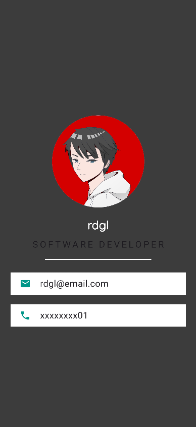

# Card

A flutter card focused on stateless widget but include tapping feature of stateful. On tapping the email or mobile-phone bar, the background-colour changes. This only contains the code for the lib folder. To make the project, one should copy the lib files (change data) and they can upload to their project, in their lib folder.

## Screenshots




## Requirements

Install [Flutter SDK](https://docs.flutter.dev/get-started/install).

## Create project

in vs code terminal, command - 

```
flutter create _your-project-name_
```

## Build

Paste the files in the lib folder. You can change the data according to you.

Create 'fonts' folder in your project and add the font- 'quicksand' in this case. If you don't have in your system, then download it- [Quicksand](https://fonts.google.com/specimen/Quicksand).

Update your pubspec.yaml file.
Add-
```
    - family: QuickSand
      fonts:
        - asset: fonts\Quicksand-Regular.ttf
```

## Run

From the project dir, (in vs code) terminal, run -

```
flutter run
```
